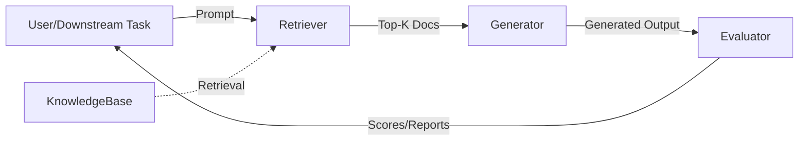

# Retrieval-Augmented Generation (RAG) for Code Generation

## Project Overview

This repository provides a robust, modular framework for Retrieval-Augmented Generation (RAG) applied to code generation tasks. The project investigates how retrieval-augmented pipelines and curated knowledge bases impact generative models, focusing on advanced engineering solutions, reproducibility, and extensibility—qualities essential for both academic research and industrial R\&D.

Key Features:

* Engineering-grade codebase and development workflow
* Modular, well-documented architecture
* Dockerized environment for full reproducibility
* Notebooks and experiment tracking
* Automated testing and CI/CD

---

## Objectives

* Evaluate the performance improvement and failure modes introduced by controlled and adversarial knowledge bases in code generation tasks.
* Optimize critical parameters: retrieval top-k, context length, re-ranking, caching, and pipeline efficiency.
* Analyze robustness of retrieval-augmented models against noisy or irrelevant knowledge bases.
* Benchmark alternative retrieval and fusion methods (BM25, SIF fusion, etc.).
* Engineer a scalable, reusable pipeline for both research and real-world deployment.

---

## Repository Structure

```
RAG-Project/
│
├── README.md
├── LICENSE
├── requirements.txt
├── .gitignore
│
├── docs/                  # Extended documentation, architecture, reports
│   └── project_overview.md
│
├── notebooks/             # Jupyter notebooks for baseline and experiments
│   ├── RAGBaseline_Original.ipynb
│   └── experiments/
│
├── src/                   # Core modular Python implementation
│   ├── rag/
│   │   ├── retriever.py
│   │   ├── generator.py
│   │   ├── evaluator.py
│   │   ├── knowledge_base.py
│   │   └── utils.py
│   ├── main.py
│
├── docker/                # Docker environment for reproducibility
│   ├── Dockerfile
│   └── start_lm_server.sh
│
├── scripts/               # Data preprocessing and automation
│
├── data/                  # Sample datasets, sanitized knowledge bases
│
├── tests/                 # Unit and integration tests
│
└── .github/               # CI/CD workflows, issue templates
```

---

## System Architecture



Detailed diagrams and architectural notes are available in /docs.

---

## Quick Start

### Prerequisites

* Python 3.10 or higher
* (Recommended) Docker

### 1. Clone the repository

```
git clone https://github.com/your-org/RAG-Project.git
cd RAG-Project
```

### 2. Install dependencies

```
pip install -r requirements.txt
```

### 3. Run the main pipeline

```
cd src
python main.py
```

### 4. (Recommended) Use Docker for reproducibility

```
cd docker
docker build -t rag-server .
bash start_lm_server.sh
```

---

## Notebooks

* RAGBaseline\_Original.ipynb: Starting point and baseline pipeline for experiments.
* notebooks/experiments/: Additional notebooks for ablation studies, parameter sweeps, and custom scenarios.
* All results and experiment logs are versioned for transparency and review.

---

## Collaboration and Code Quality

* Branching: Use descriptive feature branches (feature/, experiment/, fix/).
* Pull Requests: All changes must be submitted via PR and undergo peer review.
* Commits: Clear, atomic, and conventional commit messages.
* Issues: All bugs, improvements, or ideas must be tracked in the Issue tracker.
* Documentation: All code and notebooks must be documented (docstrings, markdown).
* Continuous Integration: Automated tests are run on every PR via GitHub Actions.
* Engineering Standards: PEP8 compliance, modular code, and reproducible experiments are enforced.


---

## Authors

* Acquadro Patrizio patrizio.acquadro@mail.polimi.it
* Colosio Giacomo giacomo.colosio@mail.polimi.it
* Drugman Tito Nicola titonicola.drugman@mail.polimi.it

## Supervisors

* Prof. Camilli Matteo, Politecnico di Milano
* Prof. Quattrocchi Giovanni Ennio, Politecnico di Milano
* Prof. Vincenzo Scotti, Politecnico di Milano
* Prof. Davide Yi Xian Hu, Politecnico di Milano

---

## License

This project is released under the MIT License (see LICENSE file).

---

## Contact

For academic collaboration or technical questions, please open an Issue or contact the project lead at patrizio.acquadro@mail.polimi.it.

Politecnico di Milano – Engineering, Research, and AI Innovation
